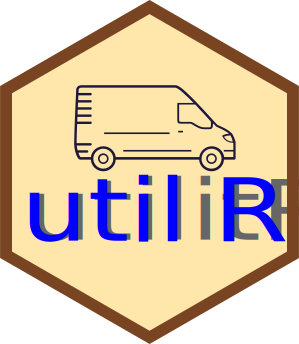

# utilitR

Some useful functions for [R](https://www.r-project.org) 



---

utilitR is a personal [R](https://www.r-project.org) package with some useful functions for R


---
## How to install utilitR

```r
install.packages("devtools")
library(devtools)
install_github("jgodet/utilitR")
```

---
### License

This package is free software; you can redistribute it and/or modify it
under the terms of the GNU General Public License, version 3, as
published by the Free Software Foundation.

This program is distributed in the hope that it will be useful, but
without any warranty; without even the implied warranty of
merchantability or fitness for a particular purpose.  See the GNU
General Public License for more details.

A copy of the GNU General Public License, version 3, is available at
<https://www.r-project.org/Licenses/GPL-3>
